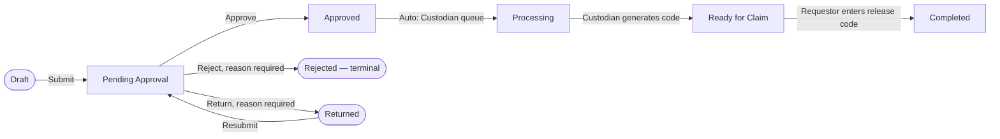
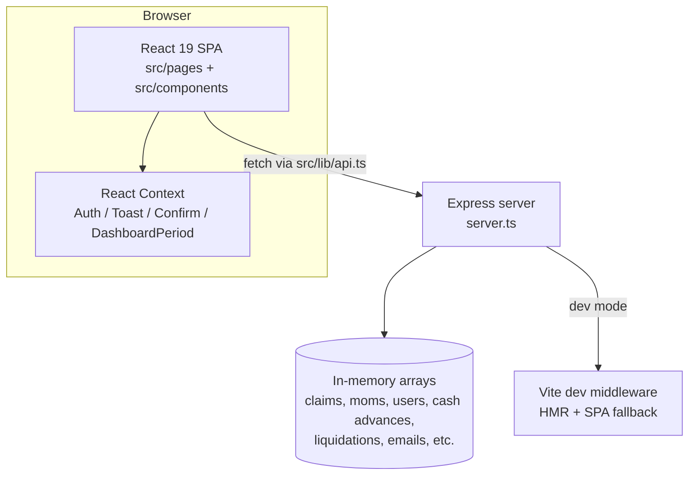

# Sales Reimbursement System

Internal web application that replaces a manual, paper-based sales expense reimbursement process with a structured digital workflow — submission, approval, finance processing, and payout tracking — plus supporting modules for cash advances, client meeting documentation, and audit history.

> **Status: prototype.** The frontend is a fully working React application, but the backend is a single Express process holding all data in in-memory JavaScript arrays. There is no database, no password-based authentication, and no persistent storage — every server restart re-seeds a fresh year of mock data. See [Known Limitations](#10-known-limitations) before treating any part of this as production-ready.

---

## Table of Contents

1. [System Overview](#1-system-overview)
2. [Features](#2-features)
3. [Workflow Explanation](#3-workflow-explanation)
4. [User Roles & Permissions](#4-user-roles--permissions)
5. [System Architecture](#5-system-architecture)
6. [Technology Stack](#6-technology-stack)
7. [Project Structure](#7-project-structure)
8. [Installation & Setup](#8-installation--setup)
9. [Development Guidelines](#9-development-guidelines)
10. [Known Limitations](#10-known-limitations)
11. [Future Roadmap](#11-future-roadmap)

---

## 1. System Overview

### What the system does

The Sales Reimbursement System digitizes the lifecycle of a sales team's out-of-pocket client-meeting expenses:

- A **Sales Requestor** documents a client meeting (Minutes of Meeting), attaches expense line items with receipts, schedules a review meeting with their manager, and submits a reimbursement claim.
- An **Approver** (the requestor's direct manager, or a temporary delegate) reviews and approves, rejects, or returns the claim.
- A **Custodian** (Finance/processing) generates a release code, disburses funds, and the Requestor confirms receipt to close the claim.
- An **Admin** manages users, the reporting-line hierarchy, company records, and system-wide settings, but cannot approve or process claims — that segregation of duties is enforced in the routing logic, not just hidden in the UI.

Alongside the core reimbursement flow, the system also handles:

- **Cash Advances** — requesting funds up front, then liquidating (reporting actual spend) afterward.
- **Minutes of Meeting (MOM)** — structured documentation of the client meeting a reimbursement is based on, either filled in via a guided template or uploaded as an existing document.
- **Approver Delegation** — an Approver can temporarily hand off their approval queue to a backup.
- **Support tickets, an audit log, a company directory, historical CSV import, and a mock email/notification outbox** used in place of a real SMTP integration.

### Business problem solved

Manual, paper-based reimbursement processes are slow, hard to audit, and easy to lose track of (who approved what, when funds were released, whether a receipt exists). This system gives every request a single, traceable record with an enforced status lifecycle, role-based access, and an append-only history of every state change.

### Target users

Internal employees at a company with a sales/field team that regularly incurs client-meeting expenses:

- Sales representatives (**Requestor**)
- Their direct managers (**Approver**)
- A finance/back-office role that disburses funds (**Custodian**)
- IT/HR administrators who manage accounts and configuration (**Admin**)

---

## 2. Features

### Sales User (Requestor)

- **Submission workflow** — a multi-step wizard (`SubmitClaim.tsx`) covering: expense line items with a per-row receipt upload (including client-side OCR auto-fill via Tesseract.js), Minutes of Meeting details (select an existing company or add a new one), and scheduling a Review Meeting with the assigned Approver, with conflict checking against the Approver's existing meetings.
- **Reimbursement management** — view own claims, resubmit a `Returned` claim with a new revision, propose a new Review Meeting time if the original is declined.
- **Cash Advances & Liquidations** — request an advance, and later submit a liquidation report itemizing actual spend against it, with automatic variance calculation (over/under/settled).
- **Tracking** — a personal Dashboard with KPIs (active claims, unliquidated float, total reimbursed), a "Ready to Claim" page for claims awaiting pickup with a release code, and full Transaction History with filters and CSV export.
- **Meeting Minutes (MOM) Manager** — create, edit, preview, and finalize/send MOMs independent of a specific claim, and link a completed one when submitting a claim.

### Approver

- **Review process** — a unified "My Inbox" combining pending claim approvals, own claims returned for revision, Review Meeting confirmations, and Cash Advance/Liquidation decisions in one queue.
- **Approval workflow** — approve, reject, or return a claim with a required comment on reject/return; bulk-approve or bulk-reject multiple pending claims at once; confirm or decline a proposed Review Meeting.
- **Cash Advance & Liquidation review** — approve/reject advance requests, review liquidation reports and either approve & close or return for revision.
- **Approver Delegation** — request or accept a temporary delegation so someone else's approval queue is covered while away, with delegated claims visibly marked as "currently with [delegate]".

### Finance/Custodian

- **Processing workflow** — a Disbursement Queue for `Processing`-status claims: generate (or manually set) a release code, choose a payment method, and mark the claim `Ready for Claim`.
- **Payment tracking** — a Disbursement History of processed claims, an Advances & Liquidations tab for releasing approved cash advances (with a release voucher reference) and collecting refunds owed on liquidations, and KPIs for missing receipts, total pending disbursement, and oldest item in the queue.

### Admin

- **User Accounts** — manage users and their reporting-line (`reports_to`) hierarchy, which is what drives claim routing.
- **Company Directory** — manage the canonical list of client companies used across MOMs and claims.
- **Audit Log** — a global, filterable view of status-change history across claims.
- **Settings** — system-wide configuration (expense categories, high-value claim threshold) and demo data management (re-seed/reset), plus the same Approver Delegation self-service tools available to Approvers.
- **Historical Import** — bulk-import prior claims from CSV.
- Notably, Admin cannot approve claims or process disbursements — that capability is not present in the Admin role's UI or permitted by the backend routes.

---

## 3. Workflow Explanation

### Actual implemented claim status lifecycle



This is the status model actually implemented in `ClaimStatus` (`src/types.ts`) and enforced in `server.ts`. A submitted claim moves straight to `Pending Approval` — there is no separate `Submitted` or `Review Meeting Scheduled` claim status. The Review Meeting the Requestor schedules at submission time is tracked as its own linked `ReviewMeeting` record (`Pending Confirmation → Confirmed`/`Declined`) and does **not** gate the Approver's ability to act on the claim itself.

### Step-by-step

1. **Submission** — Requestor fills out expense line items (each requires a category, a positive amount, and a receipt), a MOM (existing or new company, purpose, discussion details, etc.), and a Review Meeting date/time. The claim is created with status `Pending Approval`, routed to the Requestor's `reports_to` manager (or an active delegate covering that date), and the Approver is emailed.
2. **Review** — the Approver separately confirms or declines the proposed Review Meeting, and independently reviews the claim itself (single or bulk) in their inbox.
3. **Approval decision** — `Approved` routes the claim toward Processing and notifies the Requestor; `Rejected` is terminal and requires a comment; `Returned` sends it back for revision (resubmission creates a new decision record — prior ones are preserved, not overwritten).
4. **Processing** — an approved claim appears in the Custodian's Disbursement Queue as `Processing`. The Custodian generates a release code and payment method and marks it `Ready for Claim`, which emails the release code to the **Requestor**.
5. **Completion** — the Requestor enters that exact release code (`POST /api/claims/:id/claim`) to confirm receipt of funds; a wrong code is rejected. This marks the claim `Completed`.

### Key validations & business rules (as implemented)

- A Requestor without a `reports_to` manager assigned cannot submit a claim at all (`403` from the API).
- Every expense line item needs a category, a receipt, and a numeric amount greater than zero; a MOM cannot be attached in `Draft`/incomplete state, and a MOM already linked to another claim cannot be reused.
- A Review Meeting cannot be scheduled at a date/time that conflicts with the Approver's existing pending/confirmed meetings (`409` response).
- Rejecting a claim, declining a Review Meeting, returning a Liquidation, or rejecting a Cash Advance all require a comment.
- A claim's approver is always derived from `reports_to` or an active `ApproverDelegation` — the Requestor never selects their own approver. Admin can manually reassign via `PUT /api/claims/:id/reassign`.
- Claims above `systemSettings.highValueThreshold` are flagged `flagged_high_value` for extra scrutiny in the Approver's queue.
- Every status transition is written to an append-only `StatusHistory` record (no update/delete route exists for it).

---

## 4. User Roles & Permissions

Role membership is a single field on the `User` record (`UserRole`: `Requestor`, `Approver`, `Custodian`, `Admin`). Access is enforced in two layers: server-side (each route checks `req` against the authenticated user's role/ownership) and client-side (route guarding + role-filtered navigation).

| Nav item | Requestor | Approver | Custodian | Admin |
|---|:---:|:---:|:---:|:---:|
| Dashboard | ✅ | ✅ | ✅ | ✅ |
| New Request | ✅ | ✅ | – | – |
| My Inbox (approvals) | – | ✅ | – | – |
| Processing Queue | – | – | ✅ | – |
| Ready to Claim | ✅ | – | – | – |
| Transaction History | ✅ | ✅ | ✅ | – |
| Help & Support | ✅ | ✅ | ✅ | ✅ |
| System Emails / Notifications | ✅ | ✅ | ✅ | ✅ |
| Calendar | ✅ | ✅ | – | – |
| Meeting Minutes (MOM) | ✅ | ✅ | – | – |
| Receipt Archive | – | – | – | ✅ |
| User Accounts | – | – | – | ✅ |
| Company Directory | – | – | – | ✅ |
| Audit Log | – | – | – | ✅ |
| Settings (incl. Delegation) | – | ✅ | – | ✅ |

Source of truth: `navItems` in [`src/components/Layout.tsx`](src/components/Layout.tsx), re-checked independently by `ProtectedRoute` in [`src/App.tsx`](src/App.tsx) so a hidden nav link is not the only thing standing between a role and a page.

Additional server-enforced rules beyond navigation visibility:

- An Approver can only act on claims/cash advances/liquidations where they are the `current_approver_id`/`approverId` — not just any pending item.
- A Requestor can only view, resubmit, or "claim" (enter release code for) their own records.
- Only `Custodian` can call the processing routes (`ready-for-claim`, cash advance release, refund collection).
- Admin's reassignment route is the only way a claim's approver changes outside the normal `reports_to`/delegation resolution.

---

## 5. System Architecture

### High-level shape



There is a single Node process (`server.ts`) that, in development, creates a Vite dev server in middleware mode and serves the React app and the JSON API from the same origin — there's no separate API host or build step to run in parallel.

### Frontend structure

- **Routing**: `react-router-dom` v7, all routes nested under a single `Layout` shell (sidebar + header + content outlet) except `/login`. `ProtectedRoute` redirects unauthenticated users to `/login` and redirects a role to its home page if it hits a route it isn't allowed on.
- **State management**: no global state library (no Redux/Zustand/React Query). State is local `useState`/`useEffect` per page, with a few small React Contexts for cross-cutting concerns:
  - `AuthContext` — current user, login/logout.
  - `ToastProvider` — global toast notifications.
  - `ConfirmProvider` — a shared confirmation-dialog helper (`useConfirm()`) used before destructive/irreversible actions.
  - `DashboardPeriodContext` — the selected reporting period on the Dashboard.
  - Data freshness across independent pages/components is coordinated with a plain `window` custom event (`refresh-activity`), dispatched automatically by every mutating call in `src/lib/api.ts` (see below) and listened for in `Layout.tsx` to keep sidebar badge counts current without a shared store.
- **Component organization**:
  - `src/pages/` — one component per route (list/detail/queue screens).
  - `src/components/` — shared building blocks used across pages (`Layout`, `StatusBadge`, `SummaryCard`, `Attachments`, `Comments`, `ConfirmModal`, `Toast`, etc.).
  - `src/components/dashboard/` — per-role dashboard widgets (`RequestorDashboard`, `ApproverDashboard`, `CustodianDashboard`, `AdminDashboard`) plus shared chart/KPI components.
  - `src/components/ui/` — a small emerging set of generic primitives (`Button`, `Input`/`Textarea`/`Select`, `Badge`, `Card`) — not yet adopted everywhere; most existing pages still use hand-rolled Tailwind markup or the `.corp-*` utility classes defined in `index.css`.
  - `src/hooks/` — shared, non-visual logic (e.g. `useNewDataAvailable`, a polling-comparison hook used by the queue pages' "new items available" banner).

### Backend / data handling

- `server.ts` is a single Express app: no ORM, no database driver. All entities are plain in-memory arrays (`let claims: Claim[] = []`, etc.), typed against the same `src/types.ts` interfaces the frontend uses.
- On startup the server auto-seeds roughly a year of mock data (users, an org chart, claims across every status, cash advances, liquidations, emails) — this happens every restart, so nothing persists between runs.
- Authentication is a mock header scheme: the client stores a user id in `localStorage`, sends it as `X-User-Id` on every request, and the server trusts it. There is no password check, hashing, or token expiry.
- File uploads (receipts, MOM attachments) go through `multer` to a local `uploads/` folder served statically.

### Data flow (typical request)

1. A page component calls `apiFetch('/api/...', { method, body })` (`src/lib/api.ts`), which attaches the `X-User-Id` header.
2. `server.ts` resolves the user, applies role/ownership checks, mutates the relevant in-memory array(s), appends a `StatusHistory`/`Approval` record where applicable, and calls the mock email sender.
3. The response updates local component state; for non-`GET` requests, `apiFetch` also dispatches a `refresh-activity` `window` event so `Layout.tsx` can refresh unread-notification and sidebar badge counts without every page knowing about every other page.

---

## 6. Technology Stack

**Frontend**
- React 19 + TypeScript
- Vite 6 (dev server & build) with `@vitejs/plugin-react`
- React Router DOM 7
- Tailwind CSS 4 (via `@tailwindcss/vite`)
- Recharts (charts), `motion` (Framer Motion, page/element transitions)
- Phosphor Icons (`@phosphor-icons/react`)
- `date-fns` (date formatting/relative time)
- Tesseract.js (client-side OCR for receipt auto-fill)
- `clsx` / `tailwind-merge` (conditional class composition)

**Backend**
- Node.js + Express 4, run via `tsx` (TypeScript executed directly, no separate compile step in dev)
- `multer` (file uploads), `uuid` (id generation), `papaparse` (CSV import/export), `dotenv`

**Tooling / dev environment**
- TypeScript 5.8 (`tsc --noEmit` used as the lint/typecheck step — there is no ESLint config in this repo)
- `esbuild` (bundles `server.ts` for production)
- Playwright (`@playwright/test`) for end-to-end tests (`tests/reimbursement-system.spec.ts`)
- `@google/genai` is present in `package.json` but is **not imported or used anywhere in `src/`** — it appears to be leftover from the AI Studio project template rather than an active feature.

---

## 7. Project Structure

```
salesv3/
├── server.ts                # Express app: API routes + in-memory data + Vite middleware wiring
├── src/
│   ├── App.tsx               # Route table + ProtectedRoute guard
│   ├── main.tsx               # React entry point
│   ├── types.ts               # Shared TypeScript interfaces/enums (entity model)
│   ├── statusConfig.tsx        # Status → label/color/icon mapping helpers
│   ├── utils.ts               # Formatting helpers (currency, claim numbers, etc.), mock upload helper
│   ├── DebugRoleSwitcher.tsx    # Floating "Preview As…" widget for switching the logged-in demo user
│   ├── lib/
│   │   └── api.ts             # Central fetch wrapper (auth header, error handling, activity-refresh event)
│   ├── hooks/                 # Shared non-visual hooks (e.g. polling for new queue items)
│   ├── metrics/                # Dashboard metric definitions and time-scope helpers
│   ├── contexts/               # DashboardPeriodContext
│   ├── pages/                  # One component per route — the bulk of the application
│   └── components/
│       ├── dashboard/           # Per-role dashboards and chart/KPI widgets
│       ├── ui/                  # Small set of generic Button/Input/Badge/Card primitives
│       └── *.tsx                # Shared layout and domain components (Layout, StatusBadge, Attachments, ...)
├── tests/                     # Playwright end-to-end test(s)
├── public/                     # Static assets served as-is
├── uploads/                     # Local disk storage target for multer file uploads
├── dist/                       # Production build output (generated, not source)
├── vite.config.ts, tsconfig.json, playwright.config.ts, render.yaml
└── package.json
```

**Note on repository clutter**: the project root also contains a large number of one-off `patch_*.cjs`, `fix_*.cjs`, and `.sh` scripts. These are historical, single-use scripts from earlier AI-assisted edit sessions — they are not imported by the application and are not part of the running system. Treat them as disposable; don't assume they reflect current behavior.

---

## 8. Installation & Setup

### Requirements

- Node.js (a version compatible with Vite 6 / TypeScript 5.8 / the `@types/node` 22 typings — Node 18+ is expected, though no `engines` field pins an exact version in `package.json`)

### Installation

```bash
npm install
```

### Running locally

```bash
npm run dev
```

This runs `tsx server.ts`, which starts the Express server with Vite in middleware mode (frontend + API on the same port, with HMR). The server auto-seeds mock data on startup — no separate database setup step exists or is required.

### Other available scripts

```bash
npm run build      # vite build (frontend) + esbuild bundle of server.ts → dist/server.cjs
npm start           # node dist/server.cjs — runs the production build
npm run lint         # tsc --noEmit — type-checking only, no ESLint/Prettier configured
npm run test:e2e      # playwright test
npm run clean         # rm -rf dist server.js
```

### Environment variables

`.env.example` lists `GEMINI_API_KEY` and `APP_URL`, inherited from the AI Studio project template. As noted in [Technology Stack](#6-technology-stack), no code in `src/` currently calls the Gemini API, so `GEMINI_API_KEY` is not required for the application to run locally. `render.yaml` shows the only variable actually referenced for a Render.com deployment is `NODE_ENV=production`.

### Logging in

There is no self-registration or password entry. The login screen lets you pick any seeded user by email (demo accounts include `alice@example.com` (Requestor), `bob@example.com` (Approver), `carol@example.com` (Custodian), `dave@example.com` (Admin)); the password field is a display-only placeholder. Once logged in, the floating "Preview As…" widget (bottom-right, every page) lets you switch identity instantly without logging out.

---

## 9. Development Guidelines

These are patterns already established in the codebase — follow them for consistency rather than introducing a new approach per file.

- **API calls**: always go through `apiFetch` in `src/lib/api.ts` rather than calling `fetch` directly, so the auth header and the sidebar activity-refresh event stay consistent.
- **Confirmation before irreversible actions**: use the shared `useConfirm()` hook (`ConfirmModal`) rather than `window.confirm` or a bespoke modal — it's already used consistently for approve/reject/delegate-style actions.
- **Feedback**: use `useToast()` for success/error messages rather than `alert()`.
- **Status display**: use `StatusBadge` / `statusConfig.tsx` for rendering a claim/cash-advance/liquidation status rather than hand-rolling color logic per page.
- **Detail views as panels**: `ClaimDetail` and `MomDetail` both accept optional `id`/`onClose`/`onUpdate` props so they can be rendered either as a full route (`/claims/:id`) or opened as an in-page slide-over panel from a list (e.g. from `ApprovalQueue`) — reuse this pattern rather than duplicating detail-view markup.
- **Component reuse**: prefer the shared components in `src/components/` (and the newer `src/components/ui/` primitives where already adopted in a file you're touching) over new one-off markup; several pages still use raw `<input>`/`<button>` with the `.corp-input`/`.corp-btn-primary` utility classes from `index.css` — that's an existing, valid pattern too, not an anti-pattern to eliminate wholesale.
- **Naming conventions**: PascalCase component files matching their exported component name (`ApprovalQueue.tsx` exports `ApprovalQueue`); route-level screens live in `src/pages/`, reusable pieces in `src/components/`.
- **Type safety**: entity shapes are centralized in `src/types.ts` and shared between `server.ts` and the frontend — extend that file rather than redefining shapes locally when adding a field to an existing entity.
- **Optimistic UI**: where a list needs to feel responsive to a user's own action (approve/reject/release), the established pattern is a `pendingRemovalIds: Set<string>` filtered out of the rendered list immediately on click, reconciled by the normal fetch-on-success and rolled back with `toast.error` on failure — see `ApprovalQueue.tsx` / `ProcessingQueue.tsx` for reference.
- **Recommended workflow**: per the project's own working convention (documented in `CLAUDE.md`), backend/schema changes should land first and frontend integration screen-by-screen after — avoid bulk find-and-replace changes across the whole app in one pass.

---

## 10. Known Limitations

- **No real database.** All data lives in in-memory arrays in `server.ts` and is lost/re-seeded on every server restart.
- **No real authentication.** Login is an email-only user switch with a header-based mock session (`X-User-Id`); there is no password hashing, no JWT, no session expiry. `DebugRoleSwitcher` additionally exposes a one-click "log in as anyone" widget on every page — appropriate for a prototype/demo, not for production.
- **Mock email transport.** Notifications are written to an in-memory `emails` array and viewable in-app under System Emails/Notifications; no real SMTP/email provider is integrated.
- **`AdminReporting.tsx` is unused.** It's imported in `App.tsx` but not attached to any `<Route>` — the "System Reporting" charts page it implements is currently unreachable in the running app.
- **`@google/genai` is an unused dependency** — no Gemini/AI functionality is wired into the application despite the package and `.env.example` entry existing.
- **OCR is client-side and approximate.** Receipt auto-fill uses Tesseract.js in the browser; it is not guaranteed to correctly parse every receipt format.
- **"Print" is the browser's native print dialog** (`window.print()`) — there is no generated PDF document for claim summaries.
- **No automated unit/integration tests** beyond a single Playwright end-to-end spec (`tests/reimbursement-system.spec.ts`); there is no unit test suite for components or server routes.
- **No ESLint/Prettier configuration** — `npm run lint` only runs the TypeScript compiler in no-emit mode.
- **The claim status lifecycle differs from the aspirational description in `CLAUDE.md`**: there is no distinct `Submitted`/`Review Meeting Scheduled` `ClaimStatus` — a submitted claim goes straight to `Pending Approval`, and the Review Meeting is tracked as a separate, non-blocking `ReviewMeeting` record. Similarly, the release code for claiming funds is emailed to and entered by the **Requestor**, not the Custodian.
- **Large amount of dead/one-off script clutter** at the repository root (`patch_*.cjs`, `fix_*.cjs`, various `.sh` files) from prior AI-assisted edit sessions — not referenced by the running app.

---

## 11. Future Roadmap

Based on the current implementation's gaps rather than speculative new features:

- **Persist data to a real database** (e.g. PostgreSQL) behind an ORM, replacing the in-memory arrays — this is the single highest-impact change, since every other limitation (no real sessions, no durability, reseed-on-restart) stems from it.
- **Real authentication**: password hashing, session/JWT expiry, and removal (or environment-gating) of the `DebugRoleSwitcher` "Preview As…" widget outside of local development.
- **Wire up or remove `AdminReporting.tsx`** — either add its route so the System Reporting page is reachable, or delete it if superseded by the per-role dashboards.
- **Real outbound email** via an actual SMTP/email-API provider, keeping the current mock transport as a local-dev fallback (this is already anticipated in `CLAUDE.md`'s stated convention of keeping the transport swap a config change).
- **Automated test coverage** beyond the single Playwright spec — component-level tests for the optimistic-UI and role-permission logic in particular, given how much of the correctness there depends on client-side state management.
- **Finish adopting the `src/components/ui/` primitives** across the remaining pages that still hand-roll form markup, for visual and behavioral consistency (focus states, disabled states, error styling) in one place.
- **Repository cleanup**: remove the root-level one-off `patch_*`/`fix_*` scripts once confirmed unnecessary, so the project structure isn't misleading to a new contributor.
